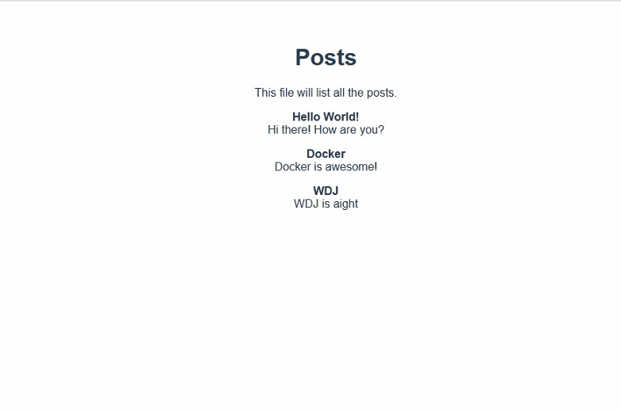

# PROYECTO:MÓDULO VIII - LABORATORIO 4
1.  Desplegar su aplicación de Frontend desarrollado en módulos anteriores   utilizando Docker (crear una copia del repositorio si se lo realizo en grupo).
2. Integrar su aplicación de Frontend y Backend dentro del mismo docker-compose.yml que se desarrolló en el laboratorio #3  

- Enviar la URL de donde se encuentre su docker-compose.yml y Dockerfile (recomendable crear un repositorio separado)
- ->Enviar la URL de su repositorio de Frontend.

- ->Incluir un detalle del orden en el que se debe levantar los servicios (db, backend, frontend)


# Integrantes
1. Edy Felix Tarqui Guarachi  

# Intrucciones
Este README, cuenta con los pasos para levantar en ambientes de desarrollo la App de MiniKardex, desarrollado con  :

- [x] Frontend (Vuejs)
- [x] MongoDB (with Mongoose schemas)
- [x] Backend (Node Express + mongo) 

### Pasos docker ###
```commandline
docker compose-compose up -d 
```
### Ejecucion ###


### Ejecucion servicios docker ###

